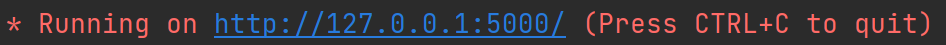
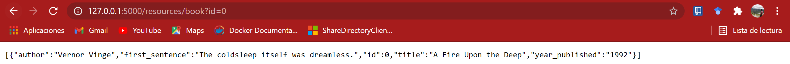

# Python REST API tutorial

### Some dependencies before start:

- Python 3.5 or grater
- Flask

## Installing Flask:

If you do not have Pycharm then execute the following commands:

```sh
pip install flask
```
If you are using Ubuntu or some flavor of Linux install:

```sh
pip install uwsgi flask
```

If you have successfully install those dependencies, it is time to start.

## Understanding the previous code

We are going to implement almost all the available methods of a REST API.

### Endpoints 

Firts of all, we need to set the endpoints or the path to access the API. The way it is done with Python es like is shown at line 27:
```python
@main_api.route('/', methods=['GET'])
```
In this case, the path to access the functionality from the function
```python
def api_home():
```
is by going to the browser access that path.

### Methods

Like we explained before, there are some methods in a REST API, that are **GET**, **PUT**, **POST**, **DELETE**.

We specify that certain resource is obtained by one of this methods by declaring it like this example:

```python
@main_api.route('/', methods=['GET'])
```
Then you can see that we specify the resource method by typing 'GET', or whatever you want to delcare.

- **GET:**
 For example, we have a list of books in the code shown in this repository. In order to access this resource from a browser, you need to execute a **GET**, and in that way you will be able to access that information:


When you need a certain element from a set of resources, in this case imagine that you need the only the first book from that JSON. In order to access this element is by passing the id through the URL when you execute a GET from the browser. 

```python
ide = int(request.args['id'])
```
The previous line shows the way we are getting that parameter.


- **POST**
 In our example you can execute a **POST** request for adding a new book. So the resource is requested by the route specified at the beggining of the declaration by the next way:
 
```python
@main_api.route('/resources/book', methods=['POST'])
 ```
 
 The function is waiting for some arguments, in this case will be the author and the title of the new book, after doing the request the book is added succesful to the list of books.
 
- **PUT**
 In this example we use the **PUT** request to modify data from a book given the id. So the specified route for this request is as shown:
 
 ```python
 @main_api.route('/resources/book', methods=['PUT'])
 ```
 You have to create a **PUT** request from the client were you pass as parameters the id of the book you want to change the data, then the value you want to change and finally the new data, then the list of books is updated with the new information.
 
- **DELETE:**
 When you want to delete some resource available in the API, this is the method you need to achieve that goal.

### Executing this little REST API example

Download the code from this repository by doing:

```sh
$ git clone https://github.com/Edjchg/Python_REST_API_tutorial
```
This command will create a directory called Python_REST_API_tutorial. So, go there by doing:

```sh
$ cd Python_REST_API_tutorial
```
In that repository, the only thing you need to do is to execute the python script by doing:

```sh
$ python3 api_hello_world.py
```
In Windows or MAC, just type:

```sh
$ python api_hello_world.py
```

If you have Pycharm, then just click the Play Button.


After this, you will see on the terminal something like this:

||
|:--:|
|**Figure 1**: The URL where the API is available.|

If you click over this link, then you will be able to see something like this:


||
|:--:|
|**Figure 2**: The API response seen from the browser.|

After this, by adding elements to the URL you will be able to access the REST API from the browser


For example, to get all the books available in the API, then just add to the URL:

```sh
http://127.0.0.1:5000/resources/books/all
```

You will get something like this:

||
|:--:|
|**Figure 3**: The API response after requesting all the books.|


But if you want to request or delete a certain book, then add to the URL something like the following:

```sh
http://127.0.0.1:5000/resources/book?id=<id of the book you want to request>
```

||
|:--:|
|**Figure 4**: The API response after requesting a certain book.|


When using **DELETE** by using some *API manager*, send the request to the API at this URL:

```sh
http://127.0.0.1:5000/book/delete?id=<the book you want to delete>
```

And the headers must be:

```sh
books = [
    {'id': 0,
     'title': 'A Fire Upon the Deep',
     'author': 'Vernor Vinge',
     'first_sentence': 'The coldsleep itself was dreamless.',
     'year_published': '1992'},
    {'id': 1,
     'title': 'The Ones Who Walk Away From Omelas',
     'author': 'Ursula K. Le Guin',
     'first_sentence': 'With a clamor of bells that set the swallows soaring, the Festival of Summer came to the city Omelas, bright-towered by the sea.',
     'published': '1973'},
    {'id': 2,
     'title': 'Dhalgren',
     'author': 'Samuel R. Delany',
     'first_sentence': 'to wound the autumnal city.',
     'published': '1975'}
]
```

The expected result of this operation is something like the following:

||
|:--:|
|**Figure 5**: The API response after requesting a delete of a certain book.|


For executing a **POST** request to add a new book just type this url:

```sh
http://127.0.0.1:5000/resources/book?title=<TITLE>&author=<AUTHOR>
```

If you add parameters and execute it you will have something like this:

||
|:--:|
|**Figure 6**: The API response after requesting to add a new book.|

And finally, let's change the title of the last book we added, as you can see, in the last result our book id is '3' 
so you have to type the next URL to create the request:

```sh
http://127.0.0.1:5000/resources/book?id=<ID>&key=<KEY>&value=<VALUE>
```

If you add the new parameters and the execute it, you will have something like this:

||
|:--:|
|**Figure 7**: The API response after requesting to change the title data.|


